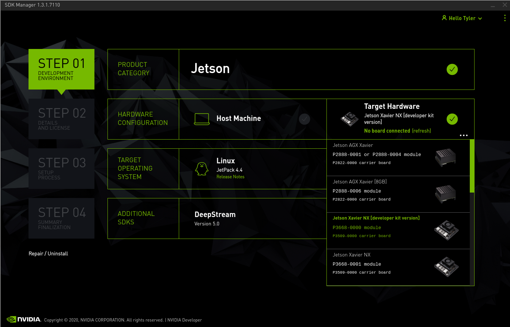
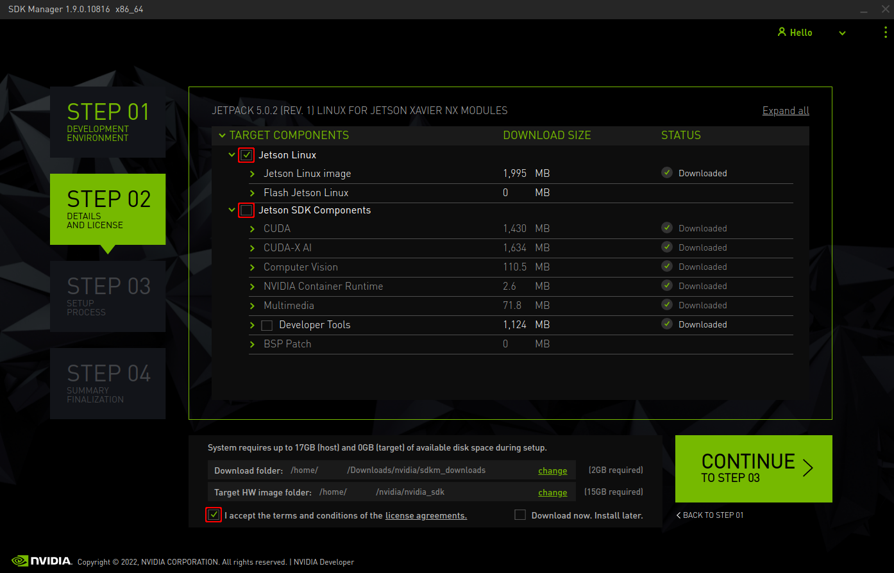

# D3 Jetson NX Carrier Bringup Instructions

This guide will aid in first time bringup of a Jetson NX Xavier that is seated
in the D3 12-Camera Carrier Board. This process may differ from previous Jetson
products you have used. The D3 Carrier board features a
different hardware layout from the NVIDIA NX Devkit that causes it to require
additional configuration from the host system after running NVIDIA SDKManager.


## 1. Power up the Board and Connect to Host System

1. Ensure that the Jetson Xavier NX has been seated into the SoM slot. Do not
   attempt to power up the D3 Jetson NX Carrier Board without a Jetson NX SoM!

2. The D3 Jetson NX Carrier Board should be powered with 12 volts into the
   Molex connector marked "Power Input (J4)".

3. The board should be connected to a host system via a Micro USB B cable into
   the "Flash USB" port. This is the Micro USB port physically located closest
   next to the Ethernet port.


## 2. Place SoM into Recovery Mode

Recovery and Reset buttons on the NX Carrier Board are located by the J5
Expansion IO and SoM fan header.

**The Reset button is marked "SW2"** and is positioned closer towards the edge of
the PCB.

**The Recovery button is marked "SW1"** and is next to "SW2", more inboard on the
PCB.

To enter recovery, the process is similar to other Jetson products.

1. Press and hold the **Recovery** button.

2. While holding the **Recovery** button, press and release the **Reset** button.

3. Then finally release the **Recovery** button.


## 3. Flash the SoM Using SDKManager

Open NVIDIA SDKManager on the host, this can be downloaded for Ubuntu 20.04, 18.04
or 16.04 from NVIDIA's website.
When opening NVIDIA SDKManager on the host system, the program will show the
option to select the type of SoM connected. If the SoM has a
micro SD slot on it, select the "Jetson NX Devkit" option. If the SoM does
**not** have a micro SD slot, select the production "Jetson NX" option.

When preparing the board for the first time, it is not recommended to
install the additional NVIDIA libraries. This can be set in "Step 2" of the
SDKManager wizard. These libraries can be installed later once the
system is configured. *(See Appendix A. for more information)*





## 4. Flash the DTB

Once the SoM has finished flashing, the D3 device tree must be installed.
Without it, the system may not be usable.

First, Find your Linux for Tegra (L4T) directory. This should be:
`$HOME/nvidia/nvidia_sdk/JetPack_4.4_Linux_JETSON_XAVIER_NX/Linux_for_Tegra/`

The L4T path may differ if a manual path was specified during install
or if you have a Jetson Xavier DevKit SoM.

The Device Tree file for the D3 Jetson NX Carrier Board can be found in the
`d3-jetson-bsp-X.X.X-bin.tar.gz`. The filepath should be
`./dtb/d3-nxc-fpdlink.dtb` inside the tarball.

Copy the DTB file to your Linux for Tegra (L4T) directory.

From a terminal inside the L4T directory, run flash.sh with the D3 DTB file as
the target.

```
# Example command for Jetson Xavier NX eMMC (No SD card)
sudo ./flash.sh -r -k kernel-dtb -d ./d3-nxc-fpdlink.dtb \
     jetson-xavier-nx-devkit-emmc mmcblk0p1

# Example command for Jetson Xavier NX SD
sudo ./flash.sh -r -k kernel-dtb -d ./d3-nxc-fpdlink.dtb \
     jetson-xavier-nx-devkit mmcblk0p1
```

## 5. Boot System and Finish Setup

Using a monitor and keyboard, complete the Ubuntu setup on the Jetson NX.

Take note the the DisplayPort output of Jetson NX is not "DP+" and will not
work with passive DisplayPort to HDMI cables.

### 5.1 Debugging Boot

If the board does not display any image after flashing, please check the
following:

- Verify that the monitor is connected with a DisplayPort cable or an active
  adapter. **Passive DisplayPort to HDMI cables will not work!**

- Check that the board has access to at least 12v and 1.5A of power.

- Ensure that the correct board type was selected in SDKManager.

- Ensure that the correct configuration was selected when installing the DTB.

If the board shows an image (such as the Ubuntu wallpaper), but not the
setup screen, please check the following:

- Verify that the correct device tree was selected in step 4 (DTB
  Installation)

- Repeat step 4 and confirm that flash.sh has succeeded.

## 6. Install the Full BSP

With the system configured, you may now use it as normal to install the full
BSP. Please refer to the general BSP instructions for more information. These
can be found as `D3-Jetson-BSP-Release-Notes.pdf` in the BSP zip file.

## 7. Post BSP Install

Once the D3 BSP has been installed, cameras can be enabled and disabled based
on physical port number using `d3-select-cameras-boot`.

The port numbering while looking directly at the side of the board with the 3
teal quad fakra connectors on the D3 Jetson NX Carrier with FPDLink is as
follows:

```
Quad Fakra Connector: J15       J14       J13
                     8 |11     4 | 7     0 | 3
                     -----     -----     -----
                     9 |10     5 | 6     1 | 2
```

## Appendix A. NVIDIA Library Installation

When installing NVIDIA Libraries through SDKManager, it has been seen that
there is inadequate space on eMMC SoMs. This will also be an issue if
a 16GB SD Card is used on a micro SD SoM.

To resolve this issue, we suggest installing the jetson multimedia API through
the package manager on the board after configuration. This will reduce that
amount of packages that are installed and save storage space.

Our `d3-build-tegra-media-api` script will install the correct version of the
Tegra Multimedia API for your current release.

If you wish to manually install NVIDIA Libraries that are not installed by the
Tegra Multimedia API, we suggest using SDKManager.
