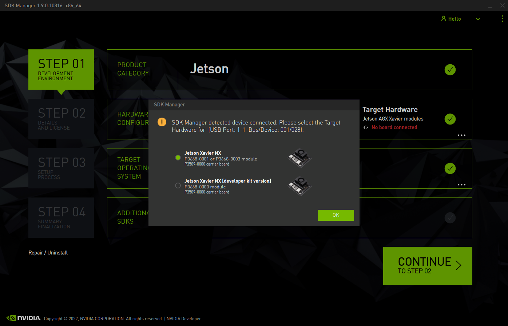

# D3 Jetson Xavier NX Carrier Bringup Instructions


\ <!--- This backslash followed by a space stops the image from floating away -->

This guide will aid in first time bringup of a Jetson Xavier NX that is seated
in the D3 12-Camera Carrier Board. This process may differ from previous Jetson
products you have used. The D3 Carrier board features a different hardware
layout from the NVIDIA Xavier NX Devkit which requires additional configuration
from the host system after running NVIDIA SDKManager.


## 1. Power up the Board and Connect to Host System

1. Ensure that the Jetson Xavier NX has been seated into the SoM slot. Do NOT
   attempt to power up the D3 Jetson Xavier NX Carrier Board without a Xavier
   NX SoM installed!

2. The D3 Jetson Xavier NX Carrier Board should be powered with 12 volts at the
   Molex connector marked "Power Input (J4)".

3. The board should be connected to a host system via a Micro-USB B cable into
   the "Flash USB" port, which is the Micro-USB port located closest
   to the Ethernet port. We recommend plugging the cable directly into your
   host system (avoid hubs and docks), as not doing so may result in slower
   flashes.


## 2. Place SoM into Recovery Mode

Recovery and Reset buttons on the carrier board are located by the
IO Expansion header (J5) and SoM fan connector (J20).

**The Reset button is marked "SW2"** and is located closer to the edge of the board.

**The Recovery button is marked "SW1"** and is located closer to the SoM.

To enter recovery, the process is similar to other Jetson products.

1. Press and hold the **Recovery** button.

2. While holding the **Recovery** button, press and release the **Reset** button.

3. Release the **Recovery** button after releasing **Reset**.


## 3. Download JetPack through SDKManager

Open NVIDIA SDKManager on the host, which can be downloaded from
[NVIDIA's website](https://developer.nvidia.com/drive/sdk-manager).
When opening NVIDIA SDKManager on the host system, the program may show the
option to select the type of SoM connected:

* If the SoM has a microSD slot on it, select the "Jetson Xavier NX [developer kit version]" option.
* If the SoM does **not** have a microSD slot, select the production "Jetson Xavier NX" option.


\ <!--- This backslash followed by a space stops this image from floating away -->

Ensure that "Host Machine" is **not** selected and that "JetPack 5.0.2 (rev. 1)" is
selected before clicking the continue button.

After continuing to the next step, ensure that you select "Jetson Linux." When
preparing the board for the first time, it is not recommended to install the Jetson
SDK components. The SDK components can be installed later after the system is flashed *(See Appendix A. for more information)*.
This can be configured as seen below:


\ <!--- This backslash followed by a space stops this image from floating away -->

Once you have accepted NVIDIA's terms and conditions, click the continue button
to begin the process of downloading JetPack. When the "SDK Manager is about to
flash your Jetson Xavier NX module" popup shows, click "Skip" and then "Finish and Exit".
We will flash the Xavier NX in the next section.

Due to the significant differences between the NVIDIA's Xavier NX developer kit
and D3's Xavier NX Carrier Board, flashing the device at this point will lead to
an unusable system and waste your time.

## 4. Flash JetPack on Xavier NX

Once JetPack has been successfully downloaded, the D3 Xavier NX Carrier Board flash
configuration must be installed. Without it, flashing the system will fail.

1. Locate your Linux for Tegra (L4T) directory. This will be:

`$HOME/nvidia/nvidia_sdk/JetPack_5.0.2_Linux_JETSON_XAVIER_NX_TARGETS/Linux_for_Tegra/`

The L4T path may be different if an alternate path was specified during installation.

2. Open the D3 Jetson BSP release zip. Open the inner `d3-jetson-bsp-bin` archive,
and locate the `supplemental` folder. Within that folder, there is a
`xavier-nx-flash-config` folder. Extract `xavier-nx-flash-config`.

3. Copy all files and folders from within `xavier-nx-flash-config` to the L4T
directory such that the files/folders `d3-nxc-emmc.conf`, `d3-nxc-sdcard.conf`,
`kernel`, and `bootloader` are present at the root of the L4T directory (e.g.,
`Linux_for_Tegra/d3-nxc-emmc.conf`).

4. In a terminal, change directory (use `cd`) to the L4T directory. Then, flash
the carrier board using the custom flash configuration:

```bash
# For Jetson Xavier NX eMMC (No microSD card)
sudo ./flash.sh d3-nxc-emmc mmcblk0p1

# For Jetson Xavier NX SD
sudo ./flash.sh d3-nxc-sdcard mmcblk0p1
```

5. Wait for the flash to complete. Once complete, you may need to press the reset
   button for the system to boot.

## 5. Boot System and Finish Setup

Using a monitor and keyboard, complete the Ubuntu setup on the Xavier NX.

Take note the the DisplayPort output of Xavier NX is not "DP+" and will not
work with passive DisplayPort to HDMI cables.

### 5.1 Fan Control

**Warning:** The Xavier NX fan curves are inverted by default, which could cause
thermal runaway in high load situations. Please see the release notes document for
a workaround.

### 5.2 Debugging Boot

If the board does not display any image after flashing, please verify the
following:

- The monitor is connected with a DisplayPort cable or an active adapter.
  **Passive DisplayPort to HDMI cables will not work!**

- The board has access to at least 12v and 1.5A of power.

- The correct flash configuration for the module was used when flashing the system.

If the board shows an image (such as the Ubuntu wallpaper), but not the
setup screen, please check the following:

- The correct flash configuration for the module was used when flashing the system.

- Repeat Step 4. Analyze the logs for any error messages and resolve them.

If none of these solutions fix the issue, reach out to our support team via
email [support@d3engineering.com](mailto:support@d3engineering.com) with
detailed information about the problem you are experiencing including flash logs
and boot serial output logs.

## 6. Install the Full BSP

With the system configured, you may now use it as normal. In order to utilize
D3's camera modules and peripherals, you must install the full BSP. Please refer
to the general BSP instructions for more information. These
can be found in `D3-Jetson-BSP-Release-Notes.pdf`, located in the BSP zip file.

## 7. Post BSP Install

Once the D3 BSP has been installed, cameras can be enabled and disabled based
on physical port number using `d3-select-cameras-boot`.

The port numbering while looking directly at the side of the board with the 3
teal quad fakra connectors on the D3 Jetson Xavier NX Carrier with FPDLink is as
follows:

```
Quad Fakra Connector: J15       J14       J13
                     8 |11     4 | 7     0 | 3
                     -----     -----     -----
                     9 |10     5 | 6     1 | 2
```

## Appendix A. NVIDIA Library Installation

When installing NVIDIA libraries through SDKManager, it has been seen that
there is inadequate space on eMMC SoMs. This will also be an issue if
a 16GB SD Card is used on a microSD SoM.

To resolve this issue, we suggest installing the Jetson Multimedia API through
the package manager on the board after configuration. This will reduce that
amount of packages that are installed and save storage space.

If you wish to manually install NVIDIA Libraries that are not installed by the
Tegra Multimedia API, we suggest using SDKManager.
